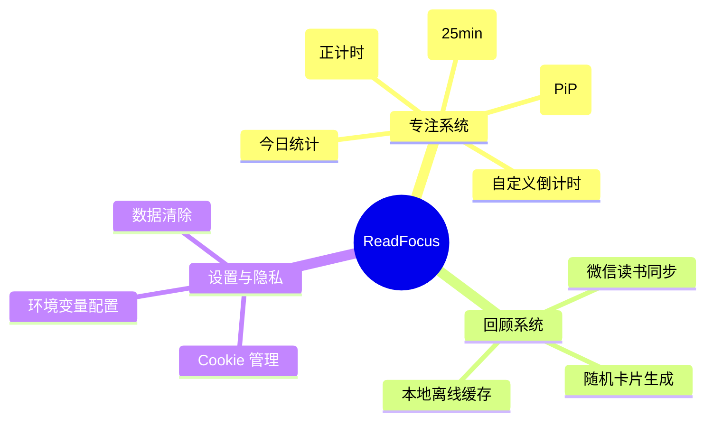
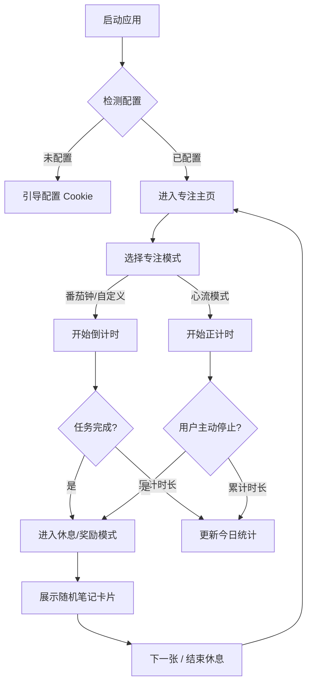

> **版本**：v2.1
> **最后更新**：2026-01-21
> **状态**：开发中 (In Development)

## 文档修订记录 (Revision History)
| 版本 | 日期 | 修改人 | 修改类型 | 修改描述 |
| :--- | :--- | :--- | :--- | :--- |
| v1.0 | 2026-01-20 | User | Create | 初始版本创建 |
| v2.0 | 2026-01-21 | Antigravity | Tech Refactor | 增加架构图与流程图，补充详细功能规格 |
| v2.1 | 2026-01-21 | Antigravity | UI/UX Upgrade | 基于用户反馈，将 UI 升级为深色沉浸式设计，并对齐原型图 |
| v2.2 | 2026-01-22 | Antigravity | Feature Update | 新增“今日专注统计”挂件；优化画中画模式（移除复杂 Mini 模式，保留自适应缩放）；修复计时统计 bug |
| v2.3 | 2026-01-22 | Antigravity | Feature & Deploy | 新增用户手动配置 Cookie 功能，支持 Vercel 在线部署；新增在线演示地址 |

## 1. 产品概述 (Product Overview)

### 1.1 背景与痛点
在深度工作与休息的循环中，知识工作者面临着**“高昂的切换成本”**与**“知识沉淀的断层”**：

1.  **休息即干扰 (Rest as Distraction)**：传统的 5 分钟休息时间极易被社交媒体和短视频占据。这些高刺激的碎片信息会破坏大脑的专注场（Attention Field），导致休息结束后难以再次进入心流状态。用户需要一种**既能放松大脑，又不会打断思维连贯性**的休息方式。
2.  **知识伪拥有 (Illusion of Competence)**：用户在微信读书积累了大量划线，却陷入了“只收不看”的怪圈。笔记如果不能在合适的时机被“偶然遇见”，就仅仅是占据存储空间的死数据，而非属于自己的知识。

### 1.2 核心价值
- **保护注意力**：重塑休息时的“信息摄入源”，用低刺激、高价值的个人笔记替代娱乐噪音，实现专注力的“软着陆”与“软起飞”。
- **知识激活**：唤醒沉睡在微信读书里的高亮笔记，利用碎片时间对抗遗忘曲线，实现“专注即复习”。
- **隐私安全**：坚持“本地优先（Local-First）”原则，个人数据绝不上传云端。

### 1.3 目标用户
- **深度阅读者**：在微信读书积累了大量划线，却苦于没有时间回顾的用户。
- **效率追求者**：希望在休息间隙也能保持思维活性，避免被碎片信息裹挟的学生及职场人士。

---

## 2. 产品架构 (Architecture)

---

## 3. 业务流程 (User Process)

用户使用产品的核心闭环流程如下：

---

## 4. UI 原型设计 (UI Prototype)

### 4.1 高保真视觉方案
基于“沉浸式专注”的设计理念，界面采用深色模式，布局分为左右两栏（在大屏下）或上下结构（移动端）。

*(图 4-1：ReadFocus 桌面端主界面概念设计)*

### 4.2 交互说明
1.  **左侧（专注区）**：
    -   **计时器**：大字号显示剩余时间，外圈为进度环。支持画中画 (PiP) 悬浮窗。
    -   **状态指示**：清晰展示当前是“Focus”还是“Break”状态。
    -   **底部数据**：常驻显示“今日专注时长”（Daily Stats）。
2.  **右侧（奖励区）**：
    -   **卡片设计**：模仿实体书签质感，包含书封、书名、作者及核心划线内容。
    -   **动态效果**：卡片出现时带有轻微的上浮动画，增加仪式感。

---

## 5. 功能需求 (Functional Specifications)

### 5.1 专注模块
| 编号 | 功能点 | 优先级 | 描述 |
| :--- | :--- | :--- | :--- |
| F01 | 标准番茄钟 | P0 | 默认 25 分钟倒计时，结束有声音提醒。 |
| F02 | 自定义时长 | P1 | 支持用户手动输入专注时长（如 45, 60 分钟）。 |
| F03 | 心流模式 | P1 | 正向计时，不设上限，记录用户的极致专注时长。 |
| F04 | 画中画支持 | P1 | 支持 Document PiP 模式，倒计时可悬浮于可以在其他应用之上；内容随窗口大小自适应缩放。 |
| F05 | 今日统计 | P1 | 自动记录当天的累积专注时长（分钟），可以本地持久化保存。 |

### 5.2 数据同步模块
| 编号 | 功能点 | 优先级 | 描述 |
| :--- | :--- | :--- | :--- |
| D01 | CookieCloud集成 | P0 | 自适应连接本地 CookieCloud 服务，获取最新 Cookie。 |
| D02 | 微信读书API | P0 | 获取笔记本列表、划线列表、评论列表。 |
| D03 | 智能代理与重试 | P0 | 自动检测系统代理（VPN），网络失败时自动切换直连模式。 |
| D04 | 本地缓存 | P1 | 将获取到的笔记缓存至 `/data` 目录，支持离线查看。 |

### 5.3 随机回顾模块
| 编号 | 功能点 | 优先级 | 描述 |
| :--- | :--- | :--- | :--- |
| R01 | 随机算法 | P0 | 公平随机策略：移除权重，随机抽书；持久化历史记录（200条）。**严格过滤：仅展示 Type=1（原文划线），屏蔽想法与书评。** |
| R03 | 全量同步 | P0 | **新增**：支持一键下载所有划线笔记至本地（LocalStorage），实现“秒开”体验与离线阅读。 |
| R02 | 兜底机制 | P1 | 若用户个人笔记为空，自动降级获取该书的“热门划线”。 |

---

## 6. 非功能需求 (Non-Functional Requirements)

1.  **隐私性 (Privacy)**：
    -   所有 API 请求均在服务端（Server-Side）发起，不暴露 Cookie 给前端。
    -   `.env` 文件严格隔离，禁止上传至代码仓库。
2.  **健壮性 (Robustness)**：
    -   在 VPN 开启/关闭切换引起网络波动时，系统应自动重试，确保持续可用。
    -   处理 WeRead 接口的 `SESSION_EXPIRED` (401) 错误，并给出友好提示。
3.  **性能 (Performance)**：
    -   页面加载速度 (LCP) 应 < 1.5秒。
    -   随机卡片生成耗时应 < 200ms。

---

## 7. 附录
- **相关链接**：[GitHub Repository](https://github.com/shumengxu6-a11y/readfocus)
- **技术栈**：Next.js 15, React 19, Tailwind CSS, Axios, TypeScript.
